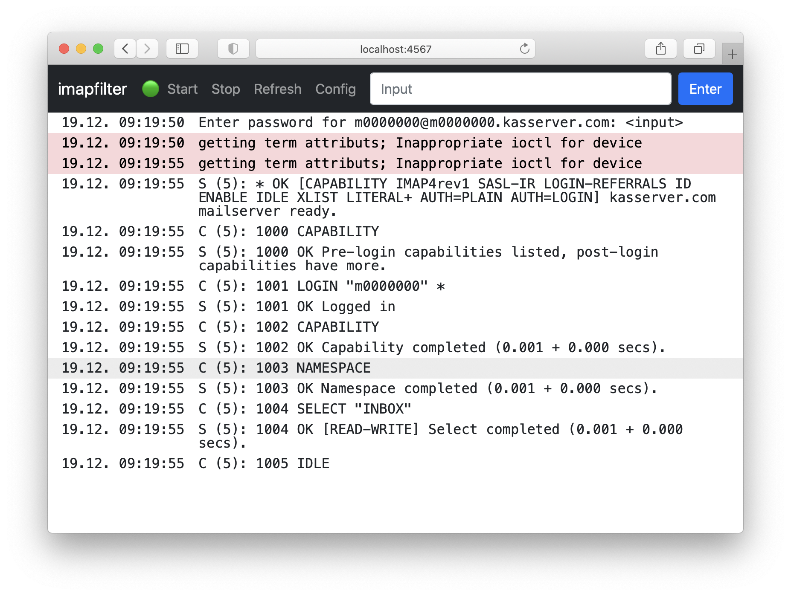

# Web UI for [`imapfilter`](https://github.com/lefcha/imapfilter)



# Motivation

I really like [`imapfilter`](https://github.com/lefcha/imapfilter) and wanted to run it on my Raspberry Pi but there were two things holding me:

1. Having to write the mail account passwords into the plaintext configuration files or having to log in via SSH to enter them.
1. Having to log in via SSH to tweak the configuration and add new rules.

So I created a simple web UI as frontend for [`imapfilter`](https://github.com/lefcha/imapfilter).
It prompts you for the mail acocunt passwords in the browser allowing you to use your password manager.
And it allows you to modify the configuration.

# Installation

- Requires Ruby >= 2.7 (other versions probably work as well, but that's what I used)
- `bundle install`
- `./imapfilter_web_ui.rb`

## Run as a Service

Modify `imapfilter-web-ui.service.template`, copy it into `/etc/systemd/system` and enable the service


```bash
sudo cp imapfilter-web-ui.service /etc/systemd/system/
sudo systemctl start imapfilter-web-ui.service          # test taht it starts correctly
sudo systemctl enable imapfilter-web-ui.service         # enable the service so it's started automatically
```

# Configuration

## Web UI

You can place an `config.ymal` file into the project folder to adjust the behaviour:

```yaml
imapfilter:
  # Path to the imapfilter LUA configuration file. 
  # Can eithe be relative to this file or absolute. 
  # Default is `imapfilter-config.lua`.
  # Requires a restart of imapfilter.
  config: imapfilter-config.lua
  # Enables printing of some brief details of the communication with the server. 
  # Default is `false`.
  # Requires a restart of imapfilter.
  verbose: true
web-ui:
  # The interface to bind to. 
  # `0.0.0.0` binds to all available interfaces.
  # Default is `0.0.0.0` for `APP_ENV=production` and `localhost` for `APP_ENV=development`.
  # Requires a restart of the web UI.
  interface: "0.0.0.0"
  # Port to access the UI on. 
  # Default is `4567`.
  # Requires a restart of the web UI.
  port: 4567
  # Enable HTTP Basic Authentication.
  # Default is off.
  # Requires a web server restart.
  basic-auth:
    username:
    password:
config-repo:
  # Git repository URL to push the configuration to.
  # Should be a private repository.
  url: git@github.com:<user>/<repo>.git
  # Branch to push to.
  # Default is `main`.
  branch: main
```

## imapfilter

`imapfilter` should be configured to use [`enter_idle()`](https://github.com/lefcha/imapfilter/blob/master/samples/extend.lua) to keep the process running.

## Configuration Repository

The `imapfilter` configuration can be pushed to a git repository after every update in the web UI.
Simply add the `config-repo` section to your `config.yaml` file.
Consider setting up a [deploy key](https://docs.github.com/en/free-pro-team@latest/developers/overview/managing-deploy-keys#deploy-keys) to limit access to the config repo.

The config is only ever _pushed_ to that repo, never pulled.
